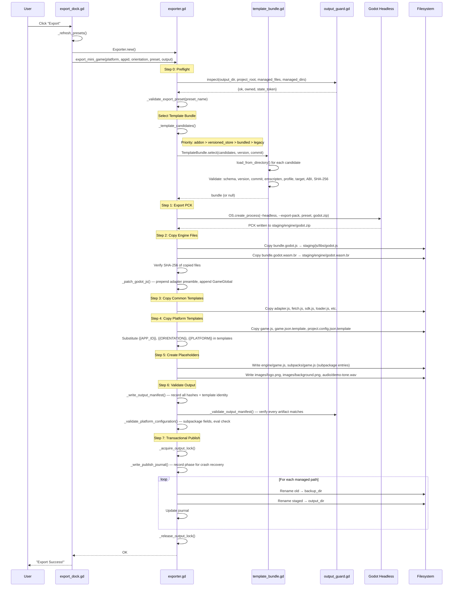

# P0 Architecture Audit

## Component Map

```
addons/godot_mini_game/
├── plugin.cfg                     # Plugin metadata (v0.3.0, entry script)
├── plugin.gd                      # EditorPlugin entry: dock + autoload registration
├── export_dock.gd                 # UI dock: platform/preset/output selection
├── export_dock.tscn               # Dock scene layout
├── exporter.gd                    # Core export orchestration (1430+ lines)
├── MiniGameSDK.gd                 # GDScript SDK autoload (224 methods, 83 signals)
├── core/
│   ├── template_bundle.gd         # Immutable engine bundle validator + selector
│   └── output_guard.gd            # Output path ownership + integrity checks
├── engine/
│   ├── godot.js                   # Precompiled Godot JS glue (bundled template)
│   ├── godot.wasm.br              # Brotli-compressed WASM engine (bundled template)
│   ├── template.json              # Exact identity manifest (schema, version, commit, hashes)
│   └── version.txt                # Canonical version string (4.6.1.stable)
├── templates/
│   ├── common/
│   │   ├── adapter.js             # Platform adapter polyfill
│   │   ├── fetch.js               # Fetch API shim
│   │   ├── audio/demo-tone.wav    # Audio placeholder
│   │   ├── images/logo.png        # Placeholder image
│   │   └── js/
│   │       ├── libs/sdk.js        # JS-side bridge (connects to MiniGameSDK.gd)
│   │       ├── image_loader.js    # Image loading from platform
│   │       ├── loader.js          # Engine loader
│   │       ├── platform_runtime.js # Platform detection + provider selection
│   │       └── worker/
│   │           └── position_reporting.js
│   ├── wechat/
│   │   ├── game.js                # WeChat entry point
│   │   ├── game.json.template     # WeChat manifest template
│   │   ├── project.config.json.template
│   │   └── project.private.config.json.template
│   ├── douyin/
│   │   ├── game.js                # Douyin entry point
│   │   ├── game.json.template     # Douyin manifest template (subPackages)
│   │   └── project.config.json.template
│   └── tiktok/
│       ├── game.js                # TikTok entry point
│       ├── game.json.template     # TikTok manifest template (subpackages)
│       └── project.config.json.template
└── GODOT_COPYRIGHT.txt            # Godot Engine copyright (from exact source version)
```

## Call Chain: Export Click → Minigame Directory



## Component Responsibilities

### `plugin.gd` (Entry Point)
- Extends `EditorPlugin`
- Creates and docks the export UI
- Registers `MiniGameSDK` as autoload singleton
- On disable: removes dock + autoload (ownership-aware)

### `export_dock.gd` (UI)
- Platform selector: wechat / douyin / tiktok
- Orientation: portrait / landscape
- AppID / Client Key input
- Web export preset selector
- Output directory browser
- Template status display (source, version, commit, ABI, revision)
- Import template ZIP button
- Export button → delegates to `exporter.gd`

### `exporter.gd` (Core — 1430+ lines)
**Export transaction lifecycle:**
1. Preflight: output path safety, ownership check, preset validation
2. Template resolution: priority-ordered candidate scan, exact identity match
3. 7-stage export: PCK → engine → common → platform → placeholders → validate → publish
4. Transactional publish: lock, backup, rename-swap, journal, rollback

**Key constants:**
- `SUPPORTED_PLATFORMS`: wechat, douyin, tiktok
- `PLATFORM_CONTRACTS`: per-platform API namespace, subpackage field, config requirements
- `MANAGED_FILES` / `MANAGED_DIRS`: owned output paths

### `core/template_bundle.gd`
- Validates template identity (schema, version, commit, emscripten, profile, target, ABI, features)
- SHA-256 verification of godot.js and godot.wasm.br
- Multi-candidate selection with priority ordering
- Version normalization (4-part canonical form)
- Commit normalization (40-char hex)
- Emscripten version comparison

### `core/output_guard.gd`
- Path safety: no filesystem root, no project inside, no symlinks
- Ownership manifest validation (`.godot-mini-game-export.json`)
- Full tree audit: required files, SHA-256 match, no undeclared paths/links
- Platform contract verification in manifest
- State token for change detection during export

### `MiniGameSDK.gd` (Runtime SDK — 1700+ lines)
- Autoload singleton registered by plugin
- JavaScript bridge initialization with ABI validation
- 224 methods across: login, ads, share, storage, network, keyboard, vibration, media, camera, video, recorder, sensors, cloud, subpackage, worker, file system, clipboard, and more
- 83 signals for async results
- Safe fallback outside mini-game runtime (no crash, signals with error strings)
- Capability detection via platform runtime

### `templates/common/js/platform_runtime.js`
- Single source of truth for platform detection
- Provider selection: TikTok > WeChat > Douyin (automatic) or explicit `__platform`
- Capability detection (canvas, image, request, storage, touch, lifecycle, etc.)
- `requirePlatform()` and `requireCapabilities()` for runtime gating
- Bridge ABI version negotiation

### `templates/common/js/libs/sdk.js`
- JS-side bridge connecting platform APIs to GDScript `MiniGameSDK`
- Maintains `godotMiniGameBridgeV1` global for GDScript `JavaScriptBridge.get_interface()`
- Handles all async callbacks, listener registration, and cleanup

## Platform Contract Matrix

| Platform | API Namespace | Subpackage Field | Private Config | JS eval | Entry |
|----------|--------------|-----------------|----------------|---------|-------|
| wechat | `wx` | `subpackages` | Required | Allowed | `game.js` |
| douyin | `tt` | `subPackages` | Not required | Allowed | `game.js` |
| tiktok | `TTMinis.game` | `subpackages` | Not required | **Forbidden** | `game.js` |

## File Generation Sources

| Output File | Source | Method |
|-------------|--------|--------|
| `adapter.js` | `templates/common/adapter.js` | Static copy |
| `fetch.js` | `templates/common/fetch.js` | Static copy |
| `audio/demo-tone.wav` | `templates/common/audio/demo-tone.wav` | Static copy |
| `images/logo.png` | `templates/common/images/logo.png` | Static copy |
| `images/background.png` | Generated placeholder | Code-gen (PNG) |
| `js/libs/sdk.js` | `templates/common/js/libs/sdk.js` | Static copy |
| `js/image_loader.js` | `templates/common/js/image_loader.js` | Static copy |
| `js/loader.js` | `templates/common/js/loader.js` | Static copy |
| `js/platform_runtime.js` | `templates/common/js/platform_runtime.js` | Static copy |
| `js/worker/position_reporting.js` | `templates/common/js/worker/position_reporting.js` | Static copy |
| `js/libs/godot.js` | `engine/godot.js` (or store) | **Patched copy** (preamble + postamble) |
| `engine/godot.wasm.br` | `engine/godot.wasm.br` (or store) | **Verified copy** (SHA-256 checked) |
| `engine/godot.zip` | Godot headless `--export-pack` | **Runtime generated** (PCK) |
| `engine/game.js` | Generated placeholder | Code-gen |
| `subpacks/game.js` | Generated placeholder | Code-gen |
| `game.js` | `templates/{platform}/game.js` | Static copy |
| `game.json` | `templates/{platform}/game.json.template` | **Template substitute** |
| `project.config.json` | `templates/{platform}/project.config.json.template` | **Template substitute** |
| `project.private.config.json` | `templates/wechat/project.private.config.json.template` | **Template substitute** (wechat only) |
| `.godot-mini-game-export.json` | Generated manifest | Code-gen (JSON, all hashes) |
